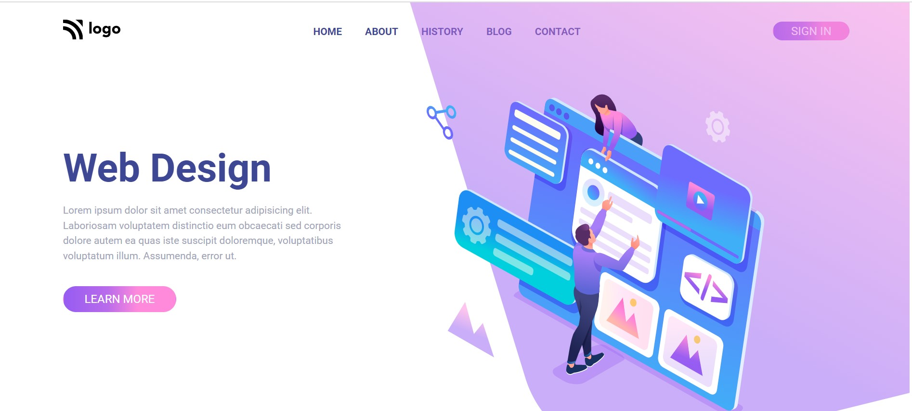

# This is a webdesign header page
This was created to learn the core concept of flex box and a custom hamburger was created to make this responsive.
## Author ✍ and 📱 Contact details
---
- This is created by Anurag katiyar
- If you have and suggestions write to me on 'anuragkatiyar1994@gmail.com'
- [Website live link]()
## Core Technology used in this project
---
- HTML5
- CSS3
- JAVASCRIPT
## ⌚ Time Taken to make this project:
It took me around 2 hours to complete this.
## image of the project 
